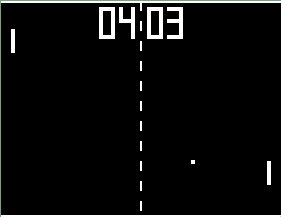

# Pong

A recreation of the classic Pong game written in C using SDL3.

This project was built to practice C programming and SDL3. The project itself includes a game loop, event handling, collision detection, ball logic, paddle movement, basic AI, score tracking, spritesheet rendering, and basic resource management.



## Controls

W / S — Move the player paddle

Esc — Quit the game

## Debian Instructions

Install Build Tools
```bash
sudo apt update

sudo apt install \
    build-essential \
    git \
    cmake \
    ninja-build \
    pkg-config
```
Build and Install SDL3
```bash
cd ~/src

git clone https://github.com/libsdl-org/SDL
cd SDL

cmake -S . -B build
cmake --build build

sudo cmake --install build
```
Build and Install SDL3_image
```bash
cd ~/src

git clone https://github.com/libsdl-org/SDL_image
cd SDL_image

cmake -S . -B build
cmake --build build

sudo cmake --install build
```
Update Shared Library Cache
```bash
sudo ldconfig
```
Build and Run Pong
```bash
gcc -Wall -Wextra -Wpedantic -fmax-errors=5 \
    src/*.c \
    -o pong \
    -lSDL3 \
    -lSDL3_image

./pong
```

## Credits

The media-loading and some of the score system code were based on techniques demonstrated in [Programming Rainbow's](https://www.youtube.com/@ProgrammingRainbow) Minesweeper / Prato Fiorito YouTube tutorial series.

The code in this project was adapted and modified for use in this Pong project.
